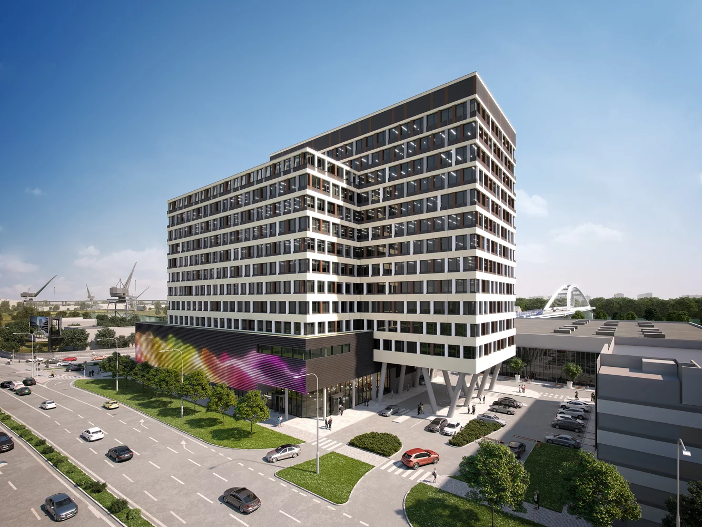

SALVIS poskytol na projekte kompletné certifikačné služby LEED vrátane všetkých odborných služieb a simulácií.

52 % Úspora pitnej vody

33 % Úspora energie

**Vybrané udržateľné opatrenia:**

- Vysoká úroveň filtrácie vzduchu, návrh zabraňujúci šírenie polutantov

- Uprednostnenie regionálnych stavebných materiálov a materiálov s obsahom recyklátu

- Úspora pitnej vody vďaka efektívnej sanite

<!--  -->
